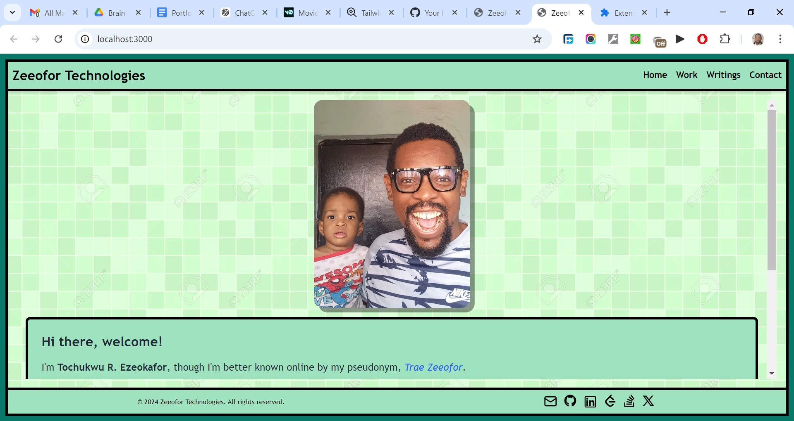

# Monday Motivation NG

My goal for this project was to create a responsive application with a strong emphasis on user experience, data visualization, secure authentication, and data persistence. To achieve this, I aimed to integrate APIs, implement robust data handling, and leverage state management tools, all while ensuring reliable backend storage for data preservation. In all I'm practicing and developing my coding competency by building projects after projects.

## Table of contents

- [Overview](#overview)
  - [The challenge](#the-challenge)
  - [Screenshot](#screenshot)
  - [Links](#links)
  - [My process](#my-process)
  - [Built with](#built-with)
  - [What I learned](#what-i-learned)
  - [Continued development](#continued-development)
  - [Useful resources](#useful-resources)
  - [Author](#author)
  - [Acknowledgments](#acknowledgments)

## Overview

### The Challenge/User Stories

* **User Authentication**  
- The user should be able to log in using GitHub or Google.  
* **Quote Management**  
- The user should be able to submit their favorite motivational quotes.
- The user should be able to edit or delete their own quotes.
- The user should be able to sort quotes based on various criteria (e.g., upvotes, date created, etc.).     
* **Voting System**  
- The user should be able to upvote or downvote quotes to indicate their agreement or disagreement.
- Each user should only be allowed to vote once per quote but can change their vote.   
* **Commenting System**
- The user should be able to leave comments on any quote.
- The user should be able to edit or delete their own comments.    
* **User Profile & Interaction**  
- The user should be able to visit a page that groups quotes by the users who created them.
- The user should be able to view individual quotes on their own pages, along with all related comments and votes.
- The user should be able to view other users’ profiles and their contributed quotes.   
* **Theme Preference**  
- The user should be able to toggle between light mode and dark mode for a personalized viewing experience.   
* **Community Engagement**  
- The user should be able to engage with the community by commenting on quotes and participating in conversations with other users.   
* **Source Code & Project Links**  
- The user should be able to access links to the project’s source code and other projects developed by Trae Zeeofor via the footer.    

### Screenshot

### Links

- Solution URL: [https://github.com/traez/mondaymotivationng](https://github.com/traez/mondaymotivationng)
- Live Site URL: [https://mondaymotivationng.vercel.app/](https://mondaymotivationng.vercel.app/)

## My process

### Built with

- Semantic HTML5 markup
- CSS custom properties
- Flexbox and CSS Grid
- Mobile-first workflow
- [React](https://reactjs.org/) - JS library
- [Next.js](https://nextjs.org/) - React framework
- Tailwind CSS
- Typescript
- Nodejs  
- MongoDB/Mongoose     
- Auth.js (NextAuth)       
- react-hook-form      
- Tanstack     
- react-icons   
- lucide-react    
- sonner  
- uuid  
- zod       

### What I learned
   
 - **Tailwind CSS Dark Mode Configuration**  
The `darkMode: ["class"]` configuration still works in Tailwind CSS because the Tailwind team retained backward compatibility for the class strategy, even though they introduced the new selector strategy in version 3.4.1 `(darkMode: 'selector')`.   
 - **Flexbox Layout for Conditional Scrollbars**  
To ensure vertical scroll lines appear only when necessary, set the `<body>` class to `flex flex-col min-h-screen`. Then, aside from the Header-Nav and Footer, set the `<Page>` element to `flex flex-grow`, so it expands to cover extra space in the container. The scrollbar will only appear as content grows and it becomes necessary.  
 - **AI Tools for Next.js Support**  
`v0.dev` AI has been really helpful in answering Next.js-related questions alongside ChatGPT, with `gptengineer.app` being a good alternative. Since both have usage limits, combining them provides a good second opinion after ChatGPT.   
 - **@hookform/resolvers Integration**  
`@hookform/resolvers` is a package that provides a set of resolvers to integrate external validation libraries with `react-hook-form`. It acts as a bridge between `react-hook-form`'s form handling capabilities and popular schema validation libraries like Zod, etc.   
 - **Absolute URLs in Server Components**  
In Next.js, relative URLs only work in client components. In server components, URLs must be absolute.   
 - **Centering Grid Items with Flexbox**  
You can use Flexbox’s `justify-items: center;` to further center each grid item within its cell.  
 - **Benefits of Using <Link> in Next.js**  
In Next.js, using the `<Link>` component for internal navigation is generally preferred over `useRouter` due to its advantages in performance and SEO. `<Link>` automatically prefetches pages, enhancing loading speeds and user experience. It also works seamlessly with Next.js's code-splitting for efficient JavaScript loading, improves SEO by helping search engines better understand site structure, and enhances accessibility by default. Additionally, `<Link>` provides a simpler and more intuitive API for handling navigation compared to the more manual approach of `useRouter`.  
 - **Accessing Dynamic Route Parameters in Server Components**  
In server components, you can access dynamic route parameters directly through the `params` argument, which is automatically provided by Next.js when the component is rendered. For example, in the code `export default function Page({ params }: { params: { slug: string } }),` the `params` object contains the dynamic values from the URL (in this case, `slug`), allowing you to use `params.slug` within the server component without needing to rely on client-side hooks like `useParams`. This is especially useful for pre-rendering and server-side logic. `useParams` is a client component hook that lets you read a route's dynamic params filled in by the current URL.   
 - **API Route Design in Next.js**  
 **Key Rules for Creating API Routes:** Design routes to represent resources, and then use appropriate HTTP Methods for different operations (GET, POST, PATCH, DELETE).
 **Parent and Child Routes:** For hierarchical resources, nest the routes properly.
`app/api/quotes/route.ts`: This is the correct place for handling operations on quotes as a collection, such as fetching all quotes or creating a new quote.  
`app/api/quotes/[id]/route.ts`: This is correct for handling operations on an individual quote, such as fetching, deleting, or updating a specific quote.  
`app/api/quotes/useremails/route.ts`: Makes sense as a dedicated route to handle fetching distinct userEmail properties, as it's a special query unrelated to CRUD operations on individual quotes.     
 - **ShadCN Best Practices and Native Styles**  
Even though ShadCN has helped set a lot of best practice standards (my personal stack etc). I'm proud that I was able to get through this project without using ShadCN itself. I applied styles natively and used its 3rd-party dependencies like Zod, react-hook-form, and TanStack etc directly.  
 - **Using Lucide-React for Icons**  
I used lucide-react independently of ShadCN, as it's very popular for icons across the board.   
 - **Array<UserData> vs UserData[]**  
`Array<UserData>` is more generic and readable, especially for complex types. `UserData[]` is the shorthand and often preferred for its brevity. Recommendation: Choose one based on personal or team preference and maintain consistency throughout your codebase.   
 - **Renaming Imports in React for Clarity**  
Renaming imports in React avoids conflicts and improves clarity. For example, when two libraries export Link, you can rename one: import { Link as LucideLink } from "lucide-react"; This lets you use both without issues. Renaming is useful for preventing collisions and making code more readable.   
 - **Ensuring Consistent Database Connections for API Routes in Production**  
I encountered an issue where my API routes timed out in production (504) due to missing MongoDB connections. In development, routes worked without error, but in production, each route needed a new connectDb() call. Unlike server actions where I connected once in the layout, I had to connect for every API call here. This caused Vercel's function to timeout in production. Ensure you connect to the database on each route to avoid this problem.  

### Continued development

- More projects; increased competence!

### Useful resources

Stackoverflow  
YouTube  
Google  
ChatGPT

## Author

- Website - [Trae Zeeofor](https://github.com/traez)
- Twitter - [@trae_z](https://twitter.com/trae_z)

## Acknowledgments

-Jehovah that keeps breath in my lungs
